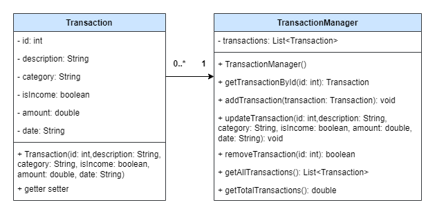

# Registro Transazioni

Un semplice programma Java per gestire le transazioni finanziarie. Permette di aggiungere, visualizzare, aggiornare e rimuovere transazioni, oltre a calcolare il totale.

## Funzionalità

- Aggiungi transazione
- Visualizza tutte le transazioni
- Aggiorna transazione
- Rimuovi transazione
- Visualizza totale transazioni

## Esecuzione

1. Compila le classi:
    ```sh
    javac Main.java
    ```

2. Esegui il Main:
    ```sh
    java Main
    ```

## Struttura
;
